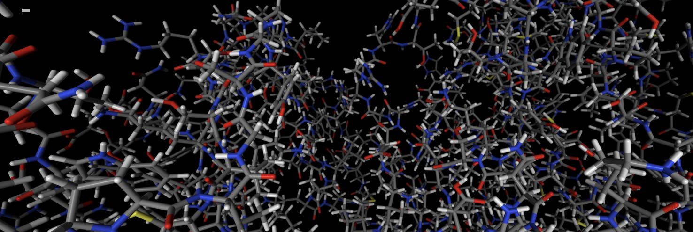

=================
Quick Start Guide
=================

Import :mod:`sire` using

>>> import sire as sr

Load a molecule from a URL, via :func:`sire.load`.

>>> mols = sr.load(f"{sr.tutorial_url}/p38.pdb")

.. note ::

   :data:`sire.tutorial_url` expands to the base URL that contains
   all tutorial files.

View molecules using :func:`~sire.mol.Molecule.view`.

>>> mols.view()

Or load molecules that need multiple input files by passing in
multiple files.

>>> mols = sr.load(f"{sr.tutorial_url}/ala.top", f"{sr.tutorial_url}/ala.traj")

.. note::

   You could use :func:`sire.expand` to put :data:`sire.tutorial_url` in front
   of ``ala.top`` and ``ala.crd``, e.g. via
   ``sr.expand(sr.tutorial_url, ["ala.top", "ala.traj"])``

There are lots of ways to search or index for molecules, e.g.

>>> mols[0]
Molecule( ACE:3   num_atoms=22 num_residues=3 )

has returned the first molecule in the system of molecules that were loaded.

>>> mols["water"]
SelectorMol( size=630
0: Molecule( WAT:4   num_atoms=3 num_residues=1 )
1: Molecule( WAT:5   num_atoms=3 num_residues=1 )
2: Molecule( WAT:6   num_atoms=3 num_residues=1 )
3: Molecule( WAT:7   num_atoms=3 num_residues=1 )
4: Molecule( WAT:8   num_atoms=3 num_residues=1 )
...
625: Molecule( WAT:629 num_atoms=3 num_residues=1 )
626: Molecule( WAT:630 num_atoms=3 num_residues=1 )
627: Molecule( WAT:631 num_atoms=3 num_residues=1 )
628: Molecule( WAT:632 num_atoms=3 num_residues=1 )
629: Molecule( WAT:633 num_atoms=3 num_residues=1 )
)

has returned all of the water molecules,

while

>>> mols[0]["element C"]
Selector<SireMol::Atom>( size=6
0:  Atom( CH3:2   [  18.98,    3.45,   13.39] )
1:  Atom( C:5     [  18.48,    4.55,   14.35] )
2:  Atom( CA:9    [  16.54,    5.03,   15.81] )
3:  Atom( CB:11   [  16.05,    6.39,   15.26] )
4:  Atom( C:15    [  15.37,    4.19,   16.43] )
5:  Atom( CH3:19  [  13.83,    3.94,   18.35] )
)

has returned all of the carbon atoms in the first molecule.

You can also search for bonds, e.g.

>>> mols[0].bonds()
SelectorBond( size=21
0: Bond( HH31:1 => CH3:2 )
1: Bond( CH3:2 => HH32:3 )
2: Bond( CH3:2 => HH33:4 )
3: Bond( CH3:2 => C:5 )
4: Bond( C:5 => O:6 )
...
16: Bond( N:17 => H:18 )
17: Bond( N:17 => CH3:19 )
18: Bond( CH3:19 => HH31:20 )
19: Bond( CH3:19 => HH32:21 )
20: Bond( CH3:19 => HH33:22 )
)

has returned all of the bonds in the first molecule, while

>>> mols.bonds("element O", "element H")
SelectorMBond( size=1260
0: MolNum(4) Bond( O:23 => H1:24 )
1: MolNum(4) Bond( O:23 => H2:25 )
2: MolNum(5) Bond( O:26 => H1:27 )
3: MolNum(5) Bond( O:26 => H2:28 )
4: MolNum(6) Bond( O:29 => H1:30 )
...
1255: MolNum(631) Bond( O:1904 => H2:1906 )
1256: MolNum(632) Bond( O:1907 => H1:1908 )
1257: MolNum(632) Bond( O:1907 => H2:1909 )
1258: MolNum(633) Bond( O:1910 => H1:1911 )
1259: MolNum(633) Bond( O:1910 => H2:1912 )
)

has returned all of the oxygen-hydrogen bonds in all molecules.

If a trajectory has been loaded (as is the case here) then
you can get the number of frames using

>>> mols.num_frames()
500

and can view the movie using

>>> mols.view()
NEED PICTURE

The :func:`~sire.mol.Molecule.view` function can be called on any
selection, so you can view the movie of the first molecule using

>>> mols[0].view()
NEED PICTURE

You can extract a subset of trajectory frames by indexing, e.g.

>>> mols[0].trajectory()[0::100].view()
NEED PICTURE

views every 100 frames of the trajectory.

If the molecule was loaded with forcefield parameters, then you can
calculate its energy using the :func:`~sire.mol.Molecule.energy`
function.

>>> mols[0].energy()
23.6917 kcal mol-1

You can get all of the components via

>>> mols[0].energy().components()
{'dihedral': 9.80034 kcal mol-1,
 'intra_LJ': -1.31125 kcal mol-1,
 'improper': 0.485545 kcal mol-1,
 '1-4_coulomb': 44.8105 kcal mol-1,
 '1-4_LJ': 3.50984 kcal mol-1,
 'intra_coulomb': -45.3982 kcal mol-1,
 'bond': 4.22497 kcal mol-1,
 'angle': 7.57006 kcal mol-1}

You can calculate the energy across a trajectory, with the results
returned as a pandas dataframe!

>>> mols[0].trajectory().energy()
	frame	time	1-4_LJ	    1-4_coulomb	angle	bond	dihedral	improper	intra_LJ	intra_coulomb	total
0	0	0.200000	3.509838	44.810452	7.570059	4.224970	9.800343	0.485545	-1.311255	-45.398214	23.691738
1	1	0.400000	2.700506	47.698455	12.470519	2.785874	11.776295	1.131481	-1.617496	-48.137253	28.808383
2	2	0.600000	2.801076	43.486411	11.607753	2.023439	11.614774	0.124729	-1.103966	-44.458051	26.096165
3	3	0.800000	3.365638	47.483966	6.524609	0.663454	11.383852	0.339333	-0.983872	-48.191509	20.585472
4	4	1.000000	3.534830	48.596027	6.517530	2.190370	10.214994	0.255331	-1.699613	-48.393881	21.215588
...	...	...	...	...	...	...	...	...	...	...	...
495	495	99.199997	2.665994	42.866319	11.339087	4.172684	9.875872	0.356887	-1.584093	-44.220004	25.472747
496	496	99.400002	3.062467	44.852774	9.268408	1.878366	10.548897	0.327064	-1.814718	-44.419100	23.704159
497	497	99.599998	3.530233	44.908117	10.487378	4.454670	10.223964	1.006034	-0.692972	-44.902055	29.015369
498	498	99.800003	3.511116	42.976288	9.017446	0.809064	10.841436	0.518190	-1.862433	-43.205035	22.606072
499	499	100.000000	3.768998	41.625135	13.629923	1.089916	11.889372	0.846805	-1.897328	-44.306434	26.646387

