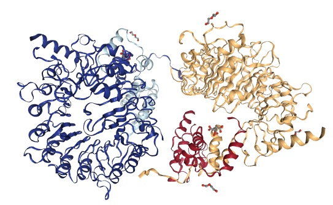

===============================
Part 2 - Indexing and Searching
===============================

The core of ``sire`` are the various :class:`~sire.mol.MoleculeView`-derived
classes, such as :class:`~sire.mol.Atom`, :class:`~sire.mol.Residue`,
:class:`~sire.mol.Chain`, :class:`~sire.mol.Segment` and
:class:`~sire.mol.Molecule`, amongst others.

These can all be considered as containers for molecular information.
:class:`~sire.mol.Atom` is a container for atomic information,
:class:`~sire.mol.Molecule` is a container for molecular information etc.

We access this information by indexing or searching these containers,
which we will learn how to do in this part of the tutorial.

First, let's load up an example protein,
``7SA1`` from the `PDB <https://www.rcsb.org/structure/7SA1>`__

>>> import sire as sr
>>> mols = sr.load("7SA1")
Downloading from 'https://files.rcsb.org/download/7SA1.pdb.gz'...
7SA1.pdb.gz
Unzipping './7SA1.pdb.gz'...
>>> mol = mols[0]
>>> print(mol)
Molecule( 7SA1:2  num_atoms=11728 num_residues=1518 )
>>> mol.view()

.. note::

   ``sire`` automatically downloads and unpacks structures from the PDB. Just
   put in the PDB code as the argument to :func:`sire.load`.

Molecules are constructed as atoms, which be can be (optionally) arranged
into residues, chains and segments. We can get the number of each using

>>> print(f"The number of atoms is {mol.num_atoms()}")
The number of atoms is 11728
>>> print(f"The number of residues is {mol.num_residues()}")
The number of residues is 1518
>>> print(f"The number of chains is {mol.num_chains()}")
The number of chains is 4
>>> print(f"The number of segments is {mol.num_segments()}")
The number of segments is 0

.. toctree::
   :maxdepth: 1

   part02/01_indexing_atoms
   part02/02_indexing_residues
   part02/03_indexing_chains
   part02/04_indexing_segments
   part02/05_indexing_molecules
   part02/06_indexing_bonds
   part02/07_indexing_angles
   part02/08_indexing_dihedrals
   part02/09_indexing_impropers
   part02/10_searching
