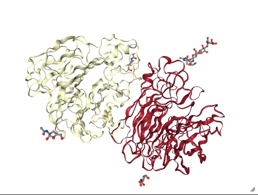
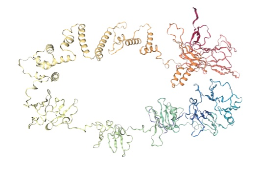
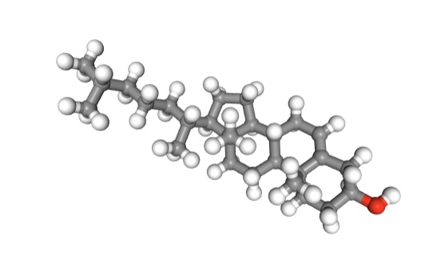

==================
Loading a molecule
==================

We load molecules using the :func:`sire.load` function. This accepts either
a filename, a URL, a `PDB code <https://www.rcsb.org>`__ or a Uniprot
code to download from the `alphafold database <https://www.alphafold.ebi.ac.uk>`__.

Loading using a PDB code
========================

Let's first load a molecule from the PDB. You do this by passing the
PDB code as the argument to :func:`sire.load`. We will load structure
``3NSS``;

>>> mols = sr.load("3NSS")
>>> print(mols)
Downloading from 'https://files.rcsb.org/download/3NSS.pdb.gz'...
Unzipping './3NSS.pdb.gz'...
System( name=3NSS num_molecules=1 num_residues=1679 num_atoms=6984 )

If you are running in a Jupyter Notebook (or similar) you can view
the molecule by calling the :func:`~sire.mol.MoleculeView.view` function,
e.g.

>>> mols.view()

.. note::

    You may see a warning instructing you to install ``nglview``.
    If you see this, install ``nglview`` by typing
    ``mamba install nglview`` at the command line.

This uses `nglviewer <https://nglviewer.org>`__ to view the molecule.

Loading from Alphafold using a Uniprot code
===========================================

You can also load structures directly from the
`alphafold database <https://www.alphafold.ebi.ac.uk>`__. To do this,
call :func:`sire.load` passing in ``alphafold:`` followed by the
Uniprot code. You can search for Uniprot codes via the
search on the `alphafold website <https://www.alphafold.ebi.ac.uk>`__.

>>> mols = sr.load("alphafold:A0A538R8Y3")
>>> print(mols)
Downloading from 'https://alphafold.ebi.ac.uk/files/AF-A0A538R8Y3-F1-model_v3.pdb'...
System( name=AF-A0A538R8Y3-F1-model_v3 num_molecules=1 num_residues=1190 num_atoms=9417 )

Again, you can use ``mols.view()`` to view the molecules.

>>> mols.view()

Loading from files
==================

You can, of course, load molecules directly from files. These can be
files that are already downloaded to your computer, or that are available
via a URL on the internet. To do this, simply pass in the path to the
file on your disk, or the URL of the file on the internet.

For example, let's load a cholesterol molecule from
`https://siremol.org/m/cholesterol.sdf <https://siremol.org/m/cholesterol.sdf>`__.

>>> mols = sr.load("https://siremol.org/m/cholesterol.sdf")
Downloading from 'https://siremol.org/m/cholesterol.sdf'...
Unzipping './cholesterol.sdf.bz2'...

>>> print(mols)
System( name=cholesterol num_molecules=1 num_residues=1 num_atoms=74 )
>>> mols.view()

Accessing the molecules
=======================

Molecules are loaded into a :class:`~sire.system.System`. You can see how
many molecules have been loaded using the :func:`~sire.mol.Molecule.num_molecules`
function;

>>> print(mols.num_molecules())
1

In this case, one molecule has been loaded. You can access this molecule via;

>>> mol = mols[0]
>>> print(mol)
Molecule( MOL:2   num_atoms=74 num_residues=1 )

This shows that the molecule is called ``MOL`` and has molecule number 2.
It contains 74 atoms in 1 residue.
