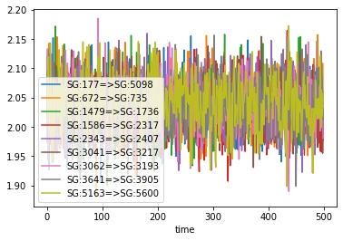
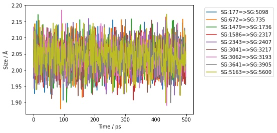
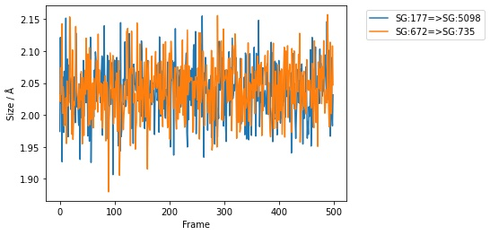
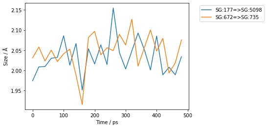
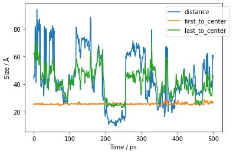

======================
Measuring Trajectories
======================

Sire has in-built support for trajectories. This allows you to measure
bonds, angles, dihedrals and other properties for across a range of
frames of a trajectory. This can be useful to see how these measurements
changed during, e.g. a molecular dynamics simulation.

For example, let's load a trajectory contained in a DCD file.

>>> import sire as sr
>>> mols = sr.load(sr.expand(sr.tutorial_url, ["h7n9.pdb", "h7n9.dcd"]))
>>> mol = mols[0]
>>> print(mol.num_frames())
501

You load trajectories in the same way as you load any other molecular file
in Sire. Just add the trajectory file (here ``h7n9.dcd``) to the list of
files to load. The file type will be determined automatically, and the
trajectory frames loaded in order (e.g. if you pass in multiple trajectory
files to load).

Sire recognises two main types of molecular data;

1. Topology data - this is information about the structure or topology
   of the molecules, e.g. how the atoms divide into residues, and how
   these divide across molecules.

2. Frame data - this is information that is specific to an individual
   trajectory frame, e.g. coordinates, velocities, space and time
   information.

Individual molecular input files contain topology data and/or frame data.
In this case, ``h7n9.pdb`` contains both topology and frame data, while
``h7n9.dcd`` contains just frame data.

Sire will load the topology information from the first file in the list
of files that contains topology information (e.g. ``h7n9.pdb``). It will
then load frames in order from all files that contain frame data
(so both ``h7n9.pdb`` and ``h7n9.dcd``).

In this case, 501 frames have been loaded. These are the one frame from
``h7n9.pdb``, which is the first frame. And then the next 500 frames
are the five hundred loaded from ``h7n9.dcd``.

In many cases you would only want to analyse the trajectory data contained
in the DCD file, and would not be interested in the frame data from the
PDB file. We can remove this frame data using the ``delete_frame`` function,
e.g.

>>> mol.delete_frame(0)
>>> print(mol.num_frames())
500

Iterating over trajectories
===========================

You iterate over the frames in a trajectory using a
:class:`sire.mol.TrajectoryIterator` that is returned by the
``.trajectory()`` function.

For example, here we will iterate over all 500 frames and just print
out the first atom of the molecule.

>>> for frame in mol.trajectory():
...     print(frame[0])
Atom( N:1     [  15.62,   42.18,   15.18] )
Atom( N:1     [  15.24,   43.24,   15.65] )
Atom( N:1     [  15.05,   42.39,   15.22] )
Atom( N:1     [  16.16,   41.74,   14.25] )
Atom( N:1     [  16.62,   41.16,   15.16] )
Atom( N:1     [  14.37,   42.47,   15.84] )
Atom( N:1     [  16.63,   42.29,   13.91] )
... etc.

You can call ``.trajectory()`` to iterate over any view of a molecule
(or views of molecules). For example, we could loop over the first
atom directly,

>>> for atom_frame in mol[0].trajectory():
...     print(atom_frame)
Atom( N:1     [  15.62,   42.18,   15.18] )
Atom( N:1     [  15.24,   43.24,   15.65] )
Atom( N:1     [  15.05,   42.39,   15.22] )
Atom( N:1     [  16.16,   41.74,   14.25] )
Atom( N:1     [  16.62,   41.16,   15.16] )
Atom( N:1     [  14.37,   42.47,   15.84] )
Atom( N:1     [  16.63,   42.29,   13.91] )
... etc.

or we could loop over the frames of the first residue, print out
its center of mass coordinates;

>>> for res_frame in mol.residue(0).trajectory():
...     print(res_frame, res_frame.coordinates())
Residue( ARG:1   num_atoms=26 ) ( 14.7759 Å, 42.2632 Å, 18.201 Å )
Residue( ARG:1   num_atoms=26 ) ( 14.368 Å, 43.886 Å, 18.7757 Å )
Residue( ARG:1   num_atoms=26 ) ( 14.3506 Å, 42.9594 Å, 18.359 Å )
Residue( ARG:1   num_atoms=26 ) ( 15.4561 Å, 41.4458 Å, 17.4479 Å )
Residue( ARG:1   num_atoms=26 ) ( 15.3717 Å, 41.1966 Å, 18.1695 Å )
Residue( ARG:1   num_atoms=26 ) ( 13.4568 Å, 43.847 Å, 18.778 Å )
Residue( ARG:1   num_atoms=26 ) ( 15.1335 Å, 43.0555 Å, 17.4046 Å )
etc.

The :class:`~sire.mol.TrajectoryIterator` is itself indexable. This allows
you to slice the frames that are iterated over. Here, we will iterate
over just the first 5 frames of the trajectory

>>> for res_frame in mol.residue(0).trajectory()[0:5]:
...     print(res_frame, res_frame.coordinates())
Residue( ARG:1   num_atoms=26 ) ( 14.7759 Å, 42.2632 Å, 18.201 Å )
Residue( ARG:1   num_atoms=26 ) ( 14.368 Å, 43.886 Å, 18.7757 Å )
Residue( ARG:1   num_atoms=26 ) ( 14.3506 Å, 42.9594 Å, 18.359 Å )
Residue( ARG:1   num_atoms=26 ) ( 15.4561 Å, 41.4458 Å, 17.4479 Å )
Residue( ARG:1   num_atoms=26 ) ( 15.3717 Å, 41.1966 Å, 18.1695 Å )

Measuring bond lengths over a trajectory
========================================

Bonds, Angles, Dihedrals and Impropers are also molecular views,
and so you can iterate over their trajectories in the same way.

For example, the ``H7N9`` protein contains a number of disulfide bonds.

We can find these bonds using

>>> print(mol.bonds("element S", "element S"))
SelectorBond( size=9
0: Bond( SG:177 => SG:5098 )
1: Bond( SG:672 => SG:735 )
2: Bond( SG:1479 => SG:1736 )
3: Bond( SG:1586 => SG:2317 )
4: Bond( SG:2343 => SG:2407 )
5: Bond( SG:3041 => SG:3217 )
6: Bond( SG:3062 => SG:3193 )
7: Bond( SG:3641 => SG:3905 )
8: Bond( SG:5163 => SG:5600 )
)

We can iterate over the trajectory frames for these bonds, and then
measure them. For example, lets iterate over the first ten frames of the
first ``S-S`` bond, and print it's length.

>>> for bond_frame in mol.bonds("element S", "element S")[0].trajectory()[0:10]:
...     print(bond_frame, bond_frame.measure())
Bond( SG:177 => SG:5098 ) 1.97428 Å
Bond( SG:177 => SG:5098 ) 2.12148 Å
Bond( SG:177 => SG:5098 ) 2.01916 Å
Bond( SG:177 => SG:5098 ) 2.03011 Å
Bond( SG:177 => SG:5098 ) 1.92681 Å
Bond( SG:177 => SG:5098 ) 2.05971 Å
Bond( SG:177 => SG:5098 ) 2.00386 Å
Bond( SG:177 => SG:5098 ) 1.9727 Å
Bond( SG:177 => SG:5098 ) 2.06847 Å
Bond( SG:177 => SG:5098 ) 1.98437 Å

We could have done this for all of the bonds, using...

>>> for bonds_frame in mol.bonds("element S", "element S").trajectory()[0:10]:
...     print(bonds_frame, bonds_frame.measures())
SelectorBond( size=9
0: Bond( SG:177 => SG:5098 )
1: Bond( SG:672 => SG:735 )
2: Bond( SG:1479 => SG:1736 )
3: Bond( SG:1586 => SG:2317 )
4: Bond( SG:2343 => SG:2407 )
5: Bond( SG:3041 => SG:3217 )
6: Bond( SG:3062 => SG:3193 )
7: Bond( SG:3641 => SG:3905 )
8: Bond( SG:5163 => SG:5600 )
) [1.97428 Å, 2.03112 Å, 2.07281 Å, 2.0191 Å, 2.04427 Å, 2.06217 Å, 2.06375 Å, 1.98086 Å, 2.00846 Å]
SelectorBond( size=9
0: Bond( SG:177 => SG:5098 )
1: Bond( SG:672 => SG:735 )
2: Bond( SG:1479 => SG:1736 )
3: Bond( SG:1586 => SG:2317 )
4: Bond( SG:2343 => SG:2407 )
5: Bond( SG:3041 => SG:3217 )
6: Bond( SG:3062 => SG:3193 )
7: Bond( SG:3641 => SG:3905 )
8: Bond( SG:5163 => SG:5600 )
) [2.12148 Å, 2.02085 Å, 2.01314 Å, 2.02394 Å, 2.03679 Å, 2.05127 Å, 2.13314 Å, 2.09479 Å, 2.01281 Å]
SelectorBond( size=9
0: Bond( SG:177 => SG:5098 )
1: Bond( SG:672 => SG:735 )
2: Bond( SG:1479 => SG:1736 )
3: Bond( SG:1586 => SG:2317 )
4: Bond( SG:2343 => SG:2407 )
5: Bond( SG:3041 => SG:3217 )
6: Bond( SG:3062 => SG:3193 )
7: Bond( SG:3641 => SG:3905 )
8: Bond( SG:5163 => SG:5600 )
) [2.01916 Å, 2.07407 Å, 2.13044 Å, 2.05 Å, 1.94306 Å, 2.02388 Å, 1.99157 Å, 2.0498 Å, 2.11982 Å]
etc...

...but you can see that we quickly reach the limit of what can sensibly
be printed to the screen.

Creating tables of measurements using pandas
============================================

To make things easier, the ``.measures()`` function on the
:class:`~sire.mol.TrajectoryIterator` will calculate all of the measures
across all of its frames, and will return the result as a dictionary.

>>> measurements = mol.bonds("element S", "element S").trajectory().measures()
>>> print(measurements)
{'frame': array([  0,   1,   2,   3,   4,   5,   6,   7,   8,   9,  10,  11,  12,
        13,  14,  15,  16,  17,  18,  19,  20,  21,  22,  23,  24,  25,
        26,  27,  28,  29,  30,  31,  32,  33,  34,  35,  36,  37,  38,
        39,  40,  41,  42,  43,  44,  45,  46,  47,  48,  49,  50,  51,
        52,  53,  54,  55,  56,  57,  58,  59,  60,  61,  62,  63,  64,
        65,  66,  67,  68,  69,  70,  71,  72,  73,  74,  75,  76,  77,
        78,  79,  80,  81,  82,  83,  84,  85,  86,  87,  88,  89,  90,
        91,  92,  93,  94,  95,  96,  97,  98,  99, 100, 101, 102, 103,
       104, 105, 106, 107, 108, 109, 110, 111, 112, 113, 114, 115, 116,
       117, 118, 119, 120, 121, 122, 123, 124, 125, 126, 127, 128, 129,
etc.

The dictionary is keyed using an identifier for each bond. The values
are numpy arrays containing the measurements for each frame.

The dictionary also has two additional columns; the first is the index of the
frame, using key ``frame``, and the second is the time of the frame, using
the key ``time``.

This format is compatible with most table-based data analysis libraries.
A popular library is pandas. You can create a pandas ``DataFrame`` from
this data by passing it into the ``DataFrame`` constructor, e.g.

.. code-block:: python

   >>> import pandas as pd
   >>> df = pd.DataFrame(measurements)
   >>> print(df)
        frame   time  SG:177=>SG:5098  ...  SG:3062=>SG:3193  SG:3641=>SG:3905  SG:5163=>SG:5600
   0        0    0.0         2.072818  ...          2.062594          2.021098          1.999742
   1        1    0.0         1.974279  ...          2.063749          1.980860          2.008463
   2        2    1.0         2.121478  ...          2.133144          2.094789          2.012815
   3        3    2.0         2.019160  ...          1.991572          2.049796          2.119825
   4        4    3.0         2.030114  ...          2.007170          2.034407          2.025154
   ..     ...    ...              ...  ...               ...               ...               ...
   496    496  495.0         2.007979  ...          2.093643          2.129553          1.998281
   497    497  496.0         2.090167  ...          2.059819          2.061035          2.062557
   498    498  497.0         2.002520  ...          2.033194          2.083489          2.018089
   499    499  498.0         1.982953  ...          2.060742          2.037879          2.028096
   500    500  499.0         2.031625  ...          1.980140          2.012541          2.056832

   [501 rows x 11 columns]

.. note::

   You may need to install pandas. You can do this with ``conda`` or ``mamba``,
   e.g. ``mamba install pandas``

.. note::

   You can set the index of the dataframe to the ``frame`` column using
   ``df.set_index("frame")``

To make things easier, you can also ask the ``.measures()`` function
to return the measurements as a ``DataFrame`` by setting ``to_pandas``
to ``True``, e.g.

.. code-block:: python

   >>> df = mol.bonds("element S", "element S").trajectory().measures(to_pandas=True)
   >>> print(df)
        frame   time  SG:177=>SG:5098  ...  SG:3062=>SG:3193  SG:3641=>SG:3905  SG:5163=>SG:5600
   0        0    0.0         2.072818  ...          2.062594          2.021098          1.999742
   1        1    0.0         1.974279  ...          2.063749          1.980860          2.008463
   2        2    1.0         2.121478  ...          2.133144          2.094789          2.012815
   3        3    2.0         2.019160  ...          1.991572          2.049796          2.119825
   4        4    3.0         2.030114  ...          2.007170          2.034407          2.025154
   ..     ...    ...              ...  ...               ...               ...               ...
   496    496  495.0         2.007979  ...          2.093643          2.129553          1.998281
   497    497  496.0         2.090167  ...          2.059819          2.061035          2.062557
   498    498  497.0         2.002520  ...          2.033194          2.083489          2.018089
   499    499  498.0         1.982953  ...          2.060742          2.037879          2.028096
   500    500  499.0         2.031625  ...          1.980140          2.012541          2.056832

   [501 rows x 11 columns]

.. note::

   The returned dataframe has had the ``frame`` column set as the index.

Changing the units of measurement
=================================

The values returned by the ``.measures()`` function are returned as
floating point numbers in the default unit for the measurement. In this
case, the values are in angstroms, as these are the default length unit.

You can change the default units using the functions in :mod:`sire.units`,
e.g.

>>> sr.units.set_length_unit(sr.units.picometer)

would change the default length units to picometers. Now, the lengths
returned by the ``.measurements()`` function will be in picometers;

.. code-block:: python

   >>> df = mol.bonds("element S", "element S").trajectory().measures(to_pandas=True)
   >>> print(df)
        SG:177=>SG:5098  SG:672=>SG:735  SG:1479=>SG:1736  ...  SG:3062=>SG:3193  SG:3641=>SG:3905  SG:5163=>SG:5600
   0         197.427854      203.111583        207.281272  ...        206.374869        198.086011        200.846281
   1         212.147805      202.084501        201.313832  ...        213.314379        209.478942        201.281457
   2         201.916013      207.407315        213.043633  ...        199.157224        204.979606        211.982462
   3         203.011406      205.894323        210.216122  ...        200.717000        203.440735        202.515447
   4         192.681088      214.281803        202.062654  ...        210.174159        209.797178        206.317985
   ..               ...             ...               ...  ...               ...               ...               ...
   495       200.797944      203.558625        210.275560  ...        209.364316        212.955313        199.828136
   496       209.016654      200.201860        209.533046  ...        205.981879        206.103546        206.255705
   497       200.251952      203.760592        204.149639  ...        203.319428        208.348883        201.808935
   498       198.295320      210.827007        199.950224  ...        206.074165        203.787857        202.809601
   499       203.162451      204.721804        202.524174  ...        198.013967        201.254053        205.683203

   [500 rows x 9 columns]

You can reset to default Sire units using

>>> sr.units.set_internal_units()

and you can get the default unit for any dimension by calling ``.get_default()``
on a unit of that dimension, e.g.

>>> print(sr.units.picometer.get_default())
1 Å

The dataframe returned by the ``.measures()`` has been modified to have
additional functions to return the units.

>>> print(df.time_unit())
ps
>>> print(df.measure_unit())
Å

Accessing measurement data by column
====================================

Pandas dataframes are great, because they give you a lot of power to
calculate averages and other statistical properties from the measurements.

For example the :func:`~pandas.DataFrame.describe` function returns a
quick statistical summary for each column;

.. code-block:: python

   >>> df = mol.bonds("element S", "element S").trajectory().measures(to_pandas=True)
   >>> print(df.describe())
               frame        time  SG:177=>SG:5098  ...  SG:3062=>SG:3193  SG:3641=>SG:3905  SG:5163=>SG:5600
   count  501.000000  501.000000       501.000000  ...        501.000000        501.000000        501.000000
   mean   250.000000  249.001996         2.035907  ...          2.038938          2.033885          2.042897
   std    144.770508  144.767061         0.042161  ...          0.039444          0.041783          0.043834
   min      0.000000    0.000000         1.906496  ...          1.889959          1.898634          1.898571
   25%    125.000000  124.000000         2.009903  ...          2.012715          2.005647          2.014213
   50%    250.000000  249.000000         2.036705  ...          2.038681          2.033499          2.044481
   75%    375.000000  374.000000         2.063463  ...          2.066688          2.059552          2.074039
   max    500.000000  499.000000         2.155093  ...          2.185094          2.156298          2.172513

   [8 rows x 11 columns]

You can access individual columns of the table by their column name.

>>> print(df["SG:177=>SG:5098"])
0      1.974279
1      2.121478
2      2.019160
3      2.030114
4      1.926811
         ...
495    2.007979
496    2.090167
497    2.002520
498    1.982953
499    2.031625
Name: SG:177=>SG:5098, Length: 500, dtype: float64

The column name was generated by the :func:`sire.colname` function. This
function generates a column name from any molecular view, e.g.

>>> print(sr.colname(mol.bonds()[0]))
N:1=>H1:2
>>> print(sr.colname(mol.atoms()[0]))
N:1
>>> print(sr.colname(mol.dihedrals()[0]))
H1:2<=N:1=CA:5=>HA:6

.. note::

   These column names will only be unique if the combination of
   atom name and atom number is unique within a molecule.

You get the column that corresponds to a particular bond by
calling :func:`~sire.colname` on that bond, e.g.

>>> bonds = mol.bonds("element S", "element S")
>>> df = bonds.trajectory().measures(to_pandas=True)
>>> print(df[sr.colname(bonds[3])].describe())
count    500.000000
mean       2.036311
std        0.042506
min        1.907295
25%        2.010268
50%        2.038025
75%        2.067480
max        2.164251
Name: SG:1586=>SG:2317, dtype: float64

You can also access multiple columns using the :func:`sire.colnames` function,

>>> print(df[sr.colnames(bonds[0:3])].describe())
       SG:177=>SG:5098  SG:672=>SG:735  SG:1479=>SG:1736
count       501.000000      501.000000        501.000000
mean          2.035907        2.040398          2.039843
std           0.042161        0.043430          0.042046
min           1.906496        1.879551          1.900181
25%           2.009903        2.010126          2.011865
50%           2.036705        2.041413          2.042487
75%           2.063463        2.068816          2.065570
max           2.155093        2.157295          2.171668

Plotting measurements
=====================

Another benefit of using pandas is that you can take advantage of it
in-built plotting capabilities. If you are using a Jupyter notebook
then you can use :func:`pandas.DataFrame.plot` to generate in-line
plots.

.. note::

   You can install jupyter using mamba via ``mamba install jupyter jupyterlab``.
   Once installed, you can start a jupyter lab instance by running
   ``jupyter lab``

.. note::

   You must also install matplotlib if you want to use pandas to
   generate plots. You can install matplotlib using the
   command ``mamba install matplotlib``

For example, you could plot all of the bond lengths using

>>> df.plot(x="time", y=sr.colnames(bonds))

You could use the pandas plotting functions to make this a bit prettier, e.g.

>>> ax = df.plot(x="time", y=sr.colnames(bonds))
>>> ax.set_xlabel(f"Time / {df.time_unit()}")
>>> ax.set_ylabel(f"Size / {df.measure_unit()}")
>>> ax.legend(bbox_to_anchor=(1.05, 1.0))

To make things easier, the above code is automatically added to the
dataframe returned by the ``.measures()`` function as
``df.pretty_plot()``, e.g.

>>> df.pretty_plot()

You can specify the ``x`` and ``y`` columns to use, e.g. here
we plot the sizes of the first two bonds against frame index.

>>> df.pretty_plot(x="frame", y=sr.colnames(bonds[0:1]))

You could also collapse this all down to a single line, e.g. here
plotting the first two bonds from every 20th frame of the trajectory;

>>> bonds[0:2].trajectory()[0::20].measures(to_pandas=True).pretty_plot()

Measuring angles, dihedrals and impropers
=========================================

You can measure angles, dihedrals and impropers across trajectories
in the same way that you do for bonds. Simply call the ``.trajectory()``
function on the molecule view and then either iterate through the
frames manually...

>>> angles = mol.angles("element S", "element S", "element C")[0:3]
>>> for frame in angles.trajectory()[0::100]:
...     print(frame, frame.measures())
SelectorAngle( size=3
0: Angle( CB:174 <= SG:177 => SG:5098 )
1: Angle( SG:177 <= SG:5098 => CB:5095 )
2: Angle( CB:669 <= SG:672 => SG:735 )
) [100.647°, 107.789°, 102.658°]
SelectorAngle( size=3
0: Angle( CB:174 <= SG:177 => SG:5098 )
1: Angle( SG:177 <= SG:5098 => CB:5095 )
2: Angle( CB:669 <= SG:672 => SG:735 )
) [108.425°, 108.255°, 102.161°]
SelectorAngle( size=3
0: Angle( CB:174 <= SG:177 => SG:5098 )
1: Angle( SG:177 <= SG:5098 => CB:5095 )
2: Angle( CB:669 <= SG:672 => SG:735 )
) [107.449°, 103.456°, 106.716°]
SelectorAngle( size=3
0: Angle( CB:174 <= SG:177 => SG:5098 )
1: Angle( SG:177 <= SG:5098 => CB:5095 )
2: Angle( CB:669 <= SG:672 => SG:735 )
) [108.96°, 102.244°, 105.909°]
SelectorAngle( size=3
0: Angle( CB:174 <= SG:177 => SG:5098 )
1: Angle( SG:177 <= SG:5098 => CB:5095 )
2: Angle( CB:669 <= SG:672 => SG:735 )
) [113.027°, 101.141°, 110.331°]
SelectorAngle( size=3
0: Angle( CB:174 <= SG:177 => SG:5098 )
1: Angle( SG:177 <= SG:5098 => CB:5095 )
2: Angle( CB:669 <= SG:672 => SG:735 )
) [106.493°, 103.807°, 101.657°]

...or use the ``.measures()`` function and convert to a pandas dataframe.

.. code-block:: python

   >>> df = angles.trajectory().measures(to_pandas=True)
   >>> print(df)
      frame   time  CB:174<=SG:177=>SG:5098  SG:177<=SG:5098=>CB:5095  CB:669<=SG:672=>SG:735
   0        0    0.0               100.646778                107.789097              102.658280
   1        1    0.0               106.123591                102.032015              103.878155
   2        2    1.0               104.469532                 96.718841              106.618866
   3        3    2.0                96.850748                106.560527              109.500329
   4        4    3.0               111.521915                107.566346              102.349405
   ..     ...    ...                      ...                       ...                     ...
   496    496  495.0               107.866246                101.751753              106.915247
   497    497  496.0               104.664555                105.813593              103.434050
   498    498  497.0                99.855355                103.378153              112.463535
   499    499  498.0               111.433986                105.148629              107.430144
   500    500  499.0               106.493204                103.807238              101.656993

   [501 rows x 5 columns]

Plotting works in the same way too.

>>> angles.trajectory()[0::20].measures(to_pandas=True).pretty_plot()

.. image:: images/04_02_05.jpg
   :alt: Graph of the first two bonds against time

Performing arbitrary measurements
=================================

You can also perform arbitrary measurements across frames of
a trajectory. The simplest way to do this is to just iterate
over the desired frames. For example, lets calculate the distance
between the centers of mass of the first and last residues in
the molecule every 100 frames.

>>> for residues in mol.residues().trajectory()[0::100]:
...     print(sr.measure(residues[0], residues[-1]))
45.6897 Å
43.1249 Å
16.5617 Å
48.1862 Å
37.0401 Å
60.8125 Å

Another way to do this is to use the ``.measures`` function, this time
passing in the function to perform the measurement.

.. code-block:: python

   >>> df = mol.residues().trajectory().measures(
   ...   lambda residues: sr.measure(residues[0], residues[-1]),
   ...   to_pandas=True)
   >>> print(df)
        frame   time     custom
   0        0    0.0  44.216253
   1        1    1.0  46.734178
   2        2    2.0  45.378243
   3        3    3.0  46.019010
   4        4    4.0  80.861715
   ..     ...    ...        ...
   495    495  495.0  42.214334
   496    496  496.0  38.257463
   497    497  497.0  61.065931
   498    498  498.0  58.582622
   499    499  499.0  60.812486

   [500 rows x 3 columns]

Notice how the custom measurement is placed into a column called
``custom``. You can control the name by passing in a dictionary
of column name / function pairs, e.g.

.. code-block:: python

   >>> df = mol.residues().trajectory().measures({
   ...   "distance" : lambda residues: sr.measure(residues[0], residues[-1]),
   ...   }, to_pandas=True)
   >>> print(df)

        frame   time   distance
   0        0    0.0  44.216253
   1        1    1.0  46.734178
   2        2    2.0  45.378243
   3        3    3.0  46.019010
   4        4    4.0  80.861715
   ..     ...    ...        ...
   495    495  495.0  42.214334
   496    496  496.0  38.257463
   497    497  497.0  61.065931
   498    498  498.0  58.582622
   499    499  499.0  60.812486

   [500 rows x 3 columns]

You can pass in as many column name / function pairs as you want to evaluate.
Here we will calculate the distance between the first and last residues,
and the distance between these two residues and the center of mass of the
molecule.

.. code-block:: python

   >>> df = mol.residues().trajectory().measures({
   ...   "distance" : lambda residues: sr.measure(residues[0], residues[-1]),
   ...   "first_to_center": lambda residues: sr.measure(residues[0], residues.molecule()),
   ...   "last_to_center": lambda residues: sr.measure(residues[-1], residues.molecule()),
   ...   }, to_pandas=True)
   >>> print(df)

        frame   time   distance  first_to_center  last_to_center
   0        0    0.0  44.216253        25.547407       62.515619
   1        1    1.0  46.734178        25.095689       62.580996
   2        2    2.0  45.378243        25.544252       61.655505
   3        3    3.0  46.019010        26.016608       57.752940
   4        4    4.0  80.861715        25.535940       63.151461
   ..     ...    ...        ...              ...             ...
   495    495  495.0  42.214334        26.030188       31.460664
   496    496  496.0  38.257463        26.851858       32.806361
   497    497  497.0  61.065931        27.685484       47.324784
   498    498  498.0  58.582622        26.512745       46.317341
   499    499  499.0  60.812486        26.131392       44.847973

   [500 rows x 5 columns]

You can, of course, plot this just as you did for simple measurements.

>>> df.pretty_plot()

