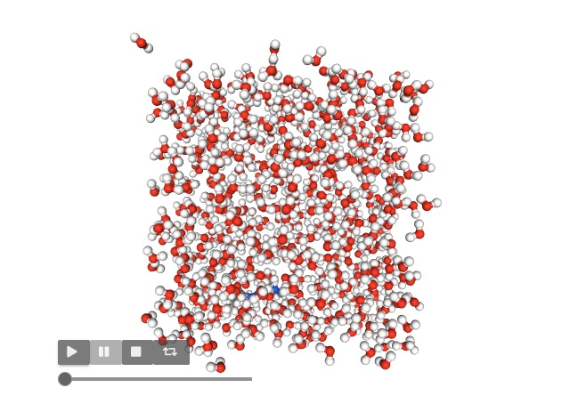
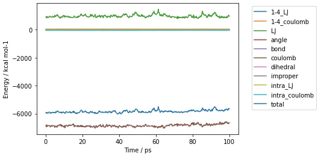
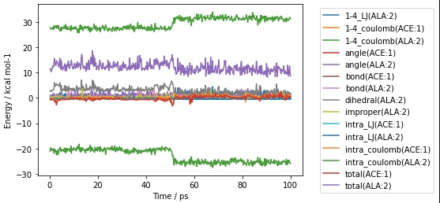

======================================
Measuring Energies Across Trajectories
======================================

Just as you can make measurements across frames of a trajectory,
you can also calculate energies across frames of a trajectory.

For example, let's now load a trajectory for the ``aladip`` system...

>>> mols = sr.load(sr.expand(sr.tutorial_url, ["ala.top", "ala.traj"]))

If you are in a Jupyter notebook or similar you can view the trajectory
using

>>> mols.view()

You can play the trajectory by clicking the play button.

There are multiple ways that you can calculate the energy of each
frame of the trajectory. You could do it yourself in a loop, e.g.

>>> for frame in mols.trajectory()[0:5]:
...     print(frame.energy())
-5919.77 kcal mol-1
-5974.75 kcal mol-1
-5928.36 kcal mol-1
-5917.37 kcal mol-1
-5968.4 kcal mol-1

calculates the total energy of the molecules for the first five frames of
the trajectory.

You could also calculate this by using the ``apply`` function, as you
did for measurements.

>>> print(mols.trajectory()[0:5].apply("energy"))
[-5919.77 kcal mol-1, -5974.75 kcal mol-1, -5928.36 kcal mol-1, -5917.37 kcal mol-1, -5968.4 kcal mol-1]

You can use the name of the function, or can supply you own custom function, e.g.

>>> print(mols.trajectory()[0:5].apply(
...                lambda frame: frame[0].energy(frame["water"])) )
[-52.8993 kcal mol-1, -46.7754 kcal mol-1, -45.9996 kcal mol-1, -53.2822 kcal mol-1, -57.4076 kcal mol-1]

calculates the energy between the first molecule and the water molecules
for the first five frames.

The simplest way though is to the use the :func:`~sire.mol.Trajectory.energy`
function of :class:`~sire.mol.Trajectory`.

>>> print(mols.trajectory().energy())
     frame        time    1-4_LJ  1-4_coulomb          LJ  ...   dihedral  improper  intra_LJ  intra_coulomb        total
0        0    0.200000  3.509838    44.810452  912.765545  ...   9.800343  0.485545 -1.311255     -45.398213 -5919.765132
1        1    0.400000  2.700506    47.698455  919.494743  ...  11.776295  1.131481 -1.617496     -48.137252 -5974.747050
2        2    0.600000  2.801076    43.486411  829.127388  ...  11.614774  0.124729 -1.103966     -44.458051 -5928.356098
3        3    0.800000  3.365638    47.483966  949.652061  ...  11.383852  0.339333 -0.983872     -48.191512 -5917.368579
4        4    1.000000  3.534830    48.596027  906.780763  ...  10.214994  0.255331 -1.699613     -48.393889 -5968.402629
..     ...         ...       ...          ...         ...  ...        ...       ...       ...            ...          ...
495    495   99.199997  2.665994    42.866319  890.741916  ...   9.875872  0.356887 -1.584092     -44.220005 -5778.616773
496    496   99.400002  3.062467    44.852774  907.572910  ...  10.548897  0.327064 -1.814718     -44.419100 -5707.182338
497    497   99.599998  3.530233    44.908117  886.446977  ...  10.223964  1.006034 -0.692972     -44.902056 -5737.309043
498    498   99.800003  3.511116    42.976288  842.364851  ...  10.841436  0.518190 -1.862433     -43.205034 -5743.862524
499    499  100.000000  3.768998    41.625135  816.979680  ...  11.889372  0.846805 -1.897328     -44.306437 -5716.669273
[500 rows x 13 columns]

This performs the calculation for each frame, returning the result as a pandas
dataframe. If you are in a Jupyter notebook or similar, you can create
a graph of this using the ``pretty_plot`` function (or the standard pandas
plotting functions), e.g. plotting the energy for every frame gives

>>> mols.trajectory().energy().pretty_plot()

Calculating energies of selections
==================================

Just as for single-point energies, you can also calculate energies of
selections across a trajectory.

For example, here is the energy for the first molecule for every frame;

>>> print(mols[0].trajectory().energy())
     frame        time    1-4_LJ  1-4_coulomb      angle      bond   dihedral  improper  intra_LJ  intra_coulomb      total
0        0    0.200000  3.509838    44.810452   7.570059  4.224970   9.800343  0.485545 -1.311255     -45.398213  23.691739
1        1    0.400000  2.700506    47.698455  12.470519  2.785874  11.776295  1.131481 -1.617496     -48.137251  28.808384
2        2    0.600000  2.801076    43.486411  11.607753  2.023439  11.614774  0.124729 -1.103966     -44.458050  26.096167
3        3    0.800000  3.365638    47.483966   6.524609  0.663454  11.383852  0.339333 -0.983872     -48.191511  20.585470
4        4    1.000000  3.534830    48.596027   6.517530  2.190370  10.214994  0.255331 -1.699613     -48.393885  21.215584
..     ...         ...       ...          ...        ...       ...        ...       ...       ...            ...        ...
495    495   99.199997  2.665994    42.866319  11.339087  4.172684   9.875872  0.356887 -1.584092     -44.220004  25.472748
496    496   99.400002  3.062467    44.852774   9.268408  1.878366  10.548897  0.327064 -1.814718     -44.419098  23.704160
497    497   99.599998  3.530233    44.908117  10.487378  4.454670  10.223964  1.006034 -0.692972     -44.902059  29.015366
498    498   99.800003  3.511116    42.976288   9.017446  0.809064  10.841436  0.518190 -1.862433     -43.205031  22.606076
499    499  100.000000  3.768998    41.625135  13.629923  1.089916  11.889372  0.846805 -1.897328     -44.306436  26.646386
[500 rows x 11 columns]

while here is the interaction energy between the first molecule and
all of the water molecules

>>> print(mols[0].trajectory().energy(mols["water"]))
     frame        time         LJ    coulomb      total
0        0    0.200000 -16.737847 -36.161409 -52.899257
1        1    0.400000  -9.301014 -37.474372 -46.775387
2        2    0.600000 -18.171437 -27.828126 -45.999562
3        3    0.800000 -17.793606 -35.488562 -53.282168
4        4    1.000000 -12.819129 -44.588454 -57.407583
..     ...         ...        ...        ...        ...
495    495   99.199997 -11.093081 -36.438605 -47.531686
496    496   99.400002 -14.898056 -29.568473 -44.466528
497    497   99.599998 -10.513597 -35.824760 -46.338358
498    498   99.800003 -12.565213 -35.923033 -48.488247
499    499  100.000000  -7.696405 -41.844028 -49.540432
[500 rows x 5 columns]

and here is the energy between the carbon atoms in the first molecule
and all of the non-carbon atoms in the first molecule

>>> print(mols[0]["element C"].trajectory().energy(mols[0]["not element C"]))
     frame        time    1-4_LJ  1-4_coulomb      angle      bond   dihedral  improper  intra_LJ  intra_coulomb      total
0        0    0.200000  1.424470    54.597537   7.512649  4.194598   9.800343  0.485545 -0.844606     -15.571905  61.598631
1        1    0.400000  0.791583    52.969358  12.008645  1.821351  11.776295  1.131481 -0.937170     -17.901480  61.660062
2        2    0.600000  1.533581    53.594240  11.531951  1.623215  11.614774  0.124729 -0.885362     -16.394078  62.743051
3        3    0.800000  1.644253    53.721723   6.478095  0.614500  11.383852  0.339333 -0.950609     -19.388795  53.842352
4        4    1.000000  1.609999    53.472406   6.515561  1.965713  10.214994  0.255331 -1.010526     -21.909819  51.113659
..     ...         ...       ...          ...        ...       ...        ...       ...       ...            ...        ...
495    495   99.199997  1.324959    51.009025  11.173632  3.007010   9.875872  0.356887 -0.907750     -17.684035  58.155600
496    496   99.400002  1.310871    51.685638   8.855937  1.300661  10.548897  0.327064 -0.896125     -22.184101  50.948842
497    497   99.599998  2.073824    51.499993  10.461966  2.345364  10.223964  1.006034 -0.867677     -20.452924  56.290544
498    498   99.800003  1.357558    50.525535   8.838606  0.306832  10.841436  0.518190 -0.940949     -18.327720  53.119488
499    499  100.000000  1.783374    50.771940  13.388107  0.649792  11.889372  0.846805 -0.883830     -19.271354  59.174206
[500 rows x 11 columns]

Calculating energies for each view in a selection
=================================================

Similarly, you can use the :func:`~sire.mol.Trajectory.energies` function
to calculate the energies of each view in a selection. For example,
to calculate the energy between each residue in the first molecule and all
the water molecules use

>>> print(mols[0].residues().trajectory().energies(mols["water"]))
     frame        time  LJ(ACE:1)  LJ(ALA:2)  LJ(NME:3)  ...  coulomb(ALA:2)  coulomb(NME:3)  total(ACE:1)  total(ALA:2)  total(NME:3)
0        0    0.200000  -6.223427  -5.550336  -4.964084  ...      -21.074595       -5.258177    -16.052065    -26.624932    -10.222260
1        1    0.400000  -3.242855  -3.941213  -2.116947  ...      -20.348710       -7.942912    -12.425605    -24.289923    -10.059858
2        2    0.600000  -5.742510  -6.968491  -5.460435  ...      -15.125554       -3.010830    -15.434253    -22.094045     -8.471265
3        3    0.800000  -5.575444  -6.994749  -5.223413  ...      -19.412484       -4.398933    -17.252589    -26.407233     -9.622346
4        4    1.000000  -4.911613  -3.534494  -4.373022  ...      -23.911765       -6.041907    -19.546395    -27.446259    -10.414929
..     ...         ...        ...        ...        ...  ...             ...             ...           ...           ...           ...
495    495   99.199997  -2.225835  -7.586764  -1.280482  ...      -11.946776       -6.009359    -20.708305    -19.533540     -7.289841
496    496   99.400002  -4.870466  -5.693474  -4.334115  ...      -13.086695       -2.485933    -18.866311    -18.780169     -6.820047
497    497   99.599998  -2.317239  -5.137583  -3.058775  ...      -15.248816       -4.309371    -18.583812    -20.386399     -7.368146
498    498   99.800003  -2.874906  -6.254290  -3.436018  ...      -17.124897       -3.969899    -17.703143    -23.379187     -7.405917
499    499  100.000000  -4.570392  -2.671509  -0.454505  ...      -17.341576       -5.990427    -23.082416    -20.013085     -6.444933
[500 rows x 11 columns]

or to calculate the energy between each individual carbon atom in the
first molecule, and all non-carbon atoms, use

>>> print(mols[0].atoms("element C").trajectory().energies(mols[0]["not element C"]))
     frame        time  1-4_LJ(C:15)  1-4_LJ(C:5)  ...  total(CA:9)  total(CB:11)  total(CH3:19)  total(CH3:2)
0        0    0.200000      0.172479     0.145310  ...     0.734309     10.422320      12.830321     -7.916957
1        1    0.400000      0.068533     0.293878  ...     0.833780     10.329925      12.680069     -5.459349
2        2    0.600000      0.277433     0.119361  ...     2.105670      9.903695      12.342441     -8.597333
3        3    0.800000      0.218850     0.293046  ...     0.648526      8.335720      11.774262     -5.820661
4        4    1.000000      0.272544     0.131482  ...     1.613490      8.462497      11.444502     -5.993019
..     ...         ...           ...          ...  ...          ...           ...            ...           ...
495    495   99.199997      0.084804     0.092928  ...     2.501087      8.260509      13.692395     -8.903780
496    496   99.400002      0.301822     0.055070  ...     0.860013      7.782723      12.373809     -9.595075
497    497   99.599998      0.287670     0.167273  ...     0.810351      8.201226      12.855330    -10.161720
498    498   99.800003      0.247033     0.071368  ...     0.636738      8.162127      12.441049    -11.020026
499    499  100.000000      0.762106     0.001875  ...     0.772173      8.378594      12.675099     -9.996188
[500 rows x 46 columns]

or you can calculate the energy between the first two residues of the
first molecule, and the last residue of that molecule,

>>> print(mols[0].residues()[0:2].trajectory().energies(mols[0].residues()[-1]))
     frame        time  1-4_LJ(ALA:2)  ...  intra_coulomb(ALA:2)  total(ACE:1)  total(ALA:2)
0        0    0.200000       0.804882  ...            -21.180433     -0.623493     11.417398
1        1    0.400000       0.345863  ...            -19.744563     -0.887233     11.519219
2        2    0.600000       0.570195  ...            -20.630107     -0.486087     10.305274
3        3    0.800000       0.583037  ...            -20.152031     -0.744566     11.144469
4        4    1.000000       0.865922  ...            -20.661027     -0.736126     11.418229
..     ...         ...            ...  ...                   ...           ...           ...
495    495   99.199997       1.541341  ...            -25.465191      0.631658      8.578779
496    496   99.400002       0.881839  ...            -24.581280      0.339605     10.761385
497    497   99.599998       1.974929  ...            -25.758041      0.272158     12.628546
498    498   99.800003       1.860815  ...            -25.768444      0.550181      9.597360
499    499  100.000000       1.335519  ...            -25.910358      0.396877      8.686331
[500 rows x 17 columns]

As before, all of the above are returned as pandas dataframes, and so can be
plotted using the standard pandas functions, or via the ``pretty_plot`` function
that is added by sire when the energies are calculated, e.g.

>>> mols[0].residues()[0:2].trajectory().energies(mols[0].residues()[-1]).pretty_plot()

Note how the column names for these dataframes include both the energy component
and an identifier for the view. You can programmatically generate these
column names using the :func:`sire.colname` function e.g.

>>> print(sr.colname(mols[0].residues()[0], "total"))
total(ACE:1)

gives the column name for the total energy component for the first
residue.

Calculating energies where the selection changes per frame
==========================================================

The :func:`~sire.mol.Trajectory.energy` and :func:`~sire.mol.Trajectory.energies`
functions calculate energies using static selections for each frame. This
means that the selection is made before calculating the energy, and then
this selection is used for each energy calculation.

This is a problem if the selection is based on something that would change
in each frame, e.g. for example the coordinates of the atoms.
For example, here we try to calculate the energy between the first molecule
and all water molecules that are within 5 Å.

>>> print(mols[0].trajectory().energy(mols["water and molecule within 5 of molidx 0"]))
     frame        time         LJ    coulomb      total
0        0    0.200000 -13.634133 -33.715126 -47.349259
1        1    0.400000  -6.036615 -36.208598 -42.245213
2        2    0.600000 -14.882135 -27.783208 -42.665343
3        3    0.800000 -14.223444 -34.152490 -48.375934
4        4    1.000000  -9.143589 -43.110359 -52.253948
..     ...         ...        ...        ...        ...
495    495   99.199997   0.293104  -3.264990  -2.971886
496    496   99.400002  -1.536769  -0.334118  -1.870887
497    497   99.599998  -0.742696  -3.797462  -4.540158
498    498   99.800003  -0.568741  -5.099334  -5.668075
499    499  100.000000  -1.961059  -1.866724  -3.827783
[500 rows x 5 columns]

This clearly hasn't done what we want, because the energy trends towards
zero over time. This is because the selection of water molecules is fixed,
and was not updated for every frame. The selected water molecules diffused
away, and so the energy trended towards zero.

You need to manually update the selection if you want it to update
for every frame. You could do this via a loop, e.g.

>>> for frame in mols.trajectory():
...     print(frame[0].energy(frame["water and molecule within 5 of molidx 0"]))
-47.3493 kcal mol-1
-43.1736 kcal mol-1
-44.3147 kcal mol-1
-49.283 kcal mol-1
-53.6223 kcal mol-1
...
-40.8416 kcal mol-1
-38.6555 kcal mol-1
-38.1635 kcal mol-1
-42.4407 kcal mol-1
-42.367 kcal mol-1

or by using ``apply``

>>> print(mols.trajectory().apply(
...          lambda frame: frame[0].energy(frame["water and molecule within 5 of molidx 0"])) )
[-47.3493 kcal mol-1, -43.1736 kcal mol-1, -44.3147 kcal mol-1,
 -49.283 kcal mol-1, -53.6223 kcal mol-1, -54.09 kcal mol-1,
...
 -42.5333 kcal mol-1, -40.8416 kcal mol-1, -38.6555 kcal mol-1,
 -38.1635 kcal mol-1, -42.4407 kcal mol-1, -42.367 kcal mol-1]
