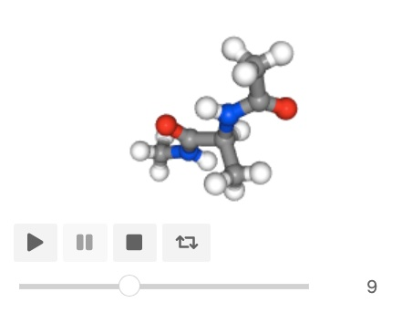

==========================
Moving Atoms and Molecules
==========================

Moving atoms and molecules is very simple. At the most basic, you
can move atoms by simply updating their coordinates property
(just as you would update any other property). For example,
let's load up the ``aladip`` system and translate the first
molecule by 1 Å along the x axis.

First, lets get the molecule and print the coordinates as they
are from the input file...

>>> mols = sr.load(sr.expand(sr.tutorial_url, ["ala.top", "ala.crd"]))
>>> mol = mols[0]
>>> print(mol.property("coordinates"))
AtomCoords( size=22
0: ( 18.4532 Å, 3.49423 Å, 12.4365 Å )
1: ( 18.9818 Å, 3.44823 Å, 13.3886 Å )
2: ( 20.0513 Å, 3.63293 Å, 13.2874 Å )
3: ( 18.798 Å, 2.43076 Å, 13.7337 Å )
4: ( 18.4805 Å, 4.54971 Å, 14.3514 Å )
...
17: ( 15.3407 Å, 5.44815 Å, 17.9626 Å )
18: ( 13.8341 Å, 3.93668 Å, 18.3509 Å )
19: ( 14.3525 Å, 3.40994 Å, 19.1521 Å )
20: ( 13.1933 Å, 4.59022 Å, 18.9428 Å )
21: ( 13.2149 Å, 3.33301 Å, 17.6874 Å )
)

Now let's edit the coordinates. The coordinates are just another property
of the molecule, so can be edited using a cursor.

>>> c = mol.cursor()
>>> for atom in c.atoms():
...     atom["coordinates"] = atom["coordinates"] + (1,0,0)
>>> mol = c.commit()
>>> print(mol.property("coordinates"))
AtomCoords( size=22
0: ( 19.4532 Å, 3.49423 Å, 12.4365 Å )
1: ( 19.9818 Å, 3.44823 Å, 13.3886 Å )
2: ( 21.0513 Å, 3.63293 Å, 13.2874 Å )
3: ( 19.798 Å, 2.43076 Å, 13.7337 Å )
4: ( 19.4805 Å, 4.54971 Å, 14.3514 Å )
...
17: ( 16.3407 Å, 5.44815 Å, 17.9626 Å )
18: ( 14.8341 Å, 3.93668 Å, 18.3509 Å )
19: ( 15.3525 Å, 3.40994 Å, 19.1521 Å )
20: ( 14.1933 Å, 4.59022 Å, 18.9428 Å )
21: ( 14.2149 Å, 3.33301 Å, 17.6874 Å )
)

.. note::

   Note that the tuple, ``(1,0,0)`` is automatically converted to a
   ``Vector`` when added to the coordinates. The units will be the current
   default length units.

In this case, we have translated every atom by 1 Å along the x-axis.
You could set the coordinates directly. For example, here we set the
coordinates of the hydrogen atoms to ``(0,0,0)``.

>>> for atom in c.atoms("element H"):
...     atom["coordinates"] = (0, 0, 0)
>>> mol = c.commit()
>>> print(mol.property("coordinates"))
AtomCoords( size=22
0: ( 0 , 0 , 0  )
1: ( 19.9818 Å, 3.44823 Å, 13.3886 Å )
2: ( 0 , 0 , 0  )
3: ( 0 , 0 , 0  )
4: ( 19.4805 Å, 4.54971 Å, 14.3514 Å )
...
17: ( 0 , 0 , 0  )
18: ( 14.8341 Å, 3.93668 Å, 18.3509 Å )
19: ( 0 , 0 , 0  )
20: ( 0 , 0 , 0  )
21: ( 0 , 0 , 0  )
)

Or, more directly

>>> c.atoms("element H")["coordinates"] = (0,0,0)
>>> mol = c.commit()
>>> print(mol.property("coordinates"))
AtomCoords( size=22
0: ( 0 , 0 , 0  )
1: ( 19.9818 Å, 3.44823 Å, 13.3886 Å )
2: ( 0 , 0 , 0  )
3: ( 0 , 0 , 0  )
4: ( 19.4805 Å, 4.54971 Å, 14.3514 Å )
...
17: ( 0 , 0 , 0  )
18: ( 14.8341 Å, 3.93668 Å, 18.3509 Å )
19: ( 0 , 0 , 0  )
20: ( 0 , 0 , 0  )
21: ( 0 , 0 , 0  )
)

.. note::

   Setting the property in a cursor collection sets the value for all
   cursors contained in that collection.

Or, you can set the coordinates of the atoms to different values, if you
pass in a list of coordinates that has the same size as the number
of cursors, e.g.

>>> c.atoms("element H")[0:3]["coordinates"] = [(1, 1, 1), (2, 2, 2), (3, 3, 3)]
>>> mol = c.commit()
>>> print(mol.property("coordinates"))
AtomCoords( size=22
0: ( 1 Å, 1 Å, 1 Å )
1: ( 19.9818 Å, 3.44823 Å, 13.3886 Å )
2: ( 2 Å, 2 Å, 2 Å )
3: ( 3 Å, 3 Å, 3 Å )
4: ( 19.4805 Å, 4.54971 Å, 14.3514 Å )
...
17: ( 0 , 0 , 0  )
18: ( 14.8341 Å, 3.93668 Å, 18.3509 Å )
19: ( 0 , 0 , 0  )
20: ( 0 , 0 , 0  )
21: ( 0 , 0 , 0  )
)

sets the coordinates of the first three hydrogen atoms to ``(1,1,1)``,
``(2,2,2)`` and ``(3,3,3)``.

Translation using a Cursor
--------------------------

The :class:`~sire.mol.Cursor` has additional functions that simplify
the process of translating, rotating and moving atoms and molecules.

For example, this is how you can use a cursor to translate
the first molecule by 1 Å along the x axis.

>>> mol = mols[0]
>>> mol = mol.cursor().translate( (1,0,0) ).commit()
>>> print(mol.property("coordinates"))
AtomCoords( size=22
0: ( 19.4532 Å, 3.49423 Å, 12.4365 Å )
1: ( 19.9818 Å, 3.44823 Å, 13.3886 Å )
2: ( 21.0513 Å, 3.63293 Å, 13.2874 Å )
3: ( 19.798 Å, 2.43076 Å, 13.7337 Å )
4: ( 19.4805 Å, 4.54971 Å, 14.3514 Å )
...
17: ( 16.3407 Å, 5.44815 Å, 17.9626 Å )
18: ( 14.8341 Å, 3.93668 Å, 18.3509 Å )
19: ( 15.3525 Å, 3.40994 Å, 19.1521 Å )
20: ( 14.1933 Å, 4.59022 Å, 18.9428 Å )
21: ( 14.2149 Å, 3.33301 Å, 17.6874 Å )
)

The :func:`~sire.mol.Cursor.translate` function translates all of the
atoms selected by the cursor by the passed vector (or passed x, y and
z components).

For example, you could translate all of the hydrogen atoms by
the vector ``(1, 2, 3)`` using

>>> cursor = mol.cursor()
>>> cursor["element H"].translate(1, 2, 3)
>>> mol = cursor.commit()
>>> print(mol.property("coordinates"))
AtomCoords( size=22
0: ( 20.4532 Å, 5.49423 Å, 15.4365 Å )
1: ( 19.9818 Å, 3.44823 Å, 13.3886 Å )
2: ( 22.0513 Å, 5.63293 Å, 16.2874 Å )
3: ( 20.798 Å, 4.43076 Å, 16.7337 Å )
4: ( 19.4805 Å, 4.54971 Å, 14.3514 Å )
...
17: ( 17.3407 Å, 7.44815 Å, 20.9626 Å )
18: ( 14.8341 Å, 3.93668 Å, 18.3509 Å )
19: ( 16.3525 Å, 5.40994 Å, 22.1521 Å )
20: ( 15.1933 Å, 6.59022 Å, 21.9428 Å )
21: ( 15.2149 Å, 5.33301 Å, 20.6874 Å )
)

.. note::

   You can pass in the vector to translate either as arguments, e.g.
   ``translate(1, 2, 3)``, or as a ``Vector``, e.g.
   ``translate(sr.maths.Vector(1,2,3))`` or ``translate((1,2,3))``.
   As for the rest of Sire, the default units are Å, which can be
   changed using, e.g. ``sr.units.set_length_unit``. You can also
   specify the units yourself, e.g. ``translate(1*sr.units.angstrom, 0, 0)``
   or ``translate(sr.maths.Vector(1*sr.units.angstrom,0, 0))``.

You can even translate all of the molecules that have been loaded,
using the cursor for the whole system.

>>> cursor = mols.cursor()
>>> cursor.translate(3,4,5)
>>> mols = cursor.commit()
>>> print(mols[1].property("coordinates"))
AtomCoords( size=3
0: ( 28.6397 Å, 12.5028 Å, 27.4241 Å )
1: ( 28.8521 Å, 12.6656 Å, 26.505 Å )
2: ( 29.3373 Å, 11.9243 Å, 27.7322 Å )
)

Rotation using a Cursor
-----------------------

You can rotate molecules using a cursor's :func:`~sire.mol.Cursor.rotate`
function.

>>> mol = mols[0]
>>> cursor = mol.cursor()
>>> cursor.rotate(5)
>>> mol = cursor.commit()
>>> print(mol.property("coordinates"))
AtomCoords( size=22
0: ( 21.5337 Å, 7.66419 Å, 17.4365 Å )
1: ( 22.0643 Å, 7.66444 Å, 18.3886 Å )
2: ( 23.1136 Å, 7.94164 Å, 18.2874 Å )
3: ( 21.9699 Å, 6.63481 Å, 18.7337 Å )
4: ( 21.4689 Å, 8.71803 Å, 19.3514 Å )
...
17: ( 18.2627 Å, 9.33939 Å, 22.9626 Å )
18: ( 16.8936 Å, 7.70237 Å, 23.3509 Å )
19: ( 17.456 Å, 7.22282 Å, 24.1521 Å )
20: ( 16.1983 Å, 8.29758 Å, 23.9428 Å )
21: ( 16.3293 Å, 7.04702 Å, 22.6874 Å )
)

In this case, we rotated the molecule by 5° about the z-axis of the molecule,
around its center of mass.

You can specify the units yourself, e.g. ``5 * sr.units.degrees``, and can
also specify the axis and centers of rotation as additional arguments, e.g.

>>> cursor.rotate(0.1*sr.units.radians, axis=(1,0,0))
>>> print(cursor["coordinates"])
AtomCoords( size=22
0: ( 21.5337 Å, 7.99007 Å, 17.3691 Å )
1: ( 22.0643 Å, 7.89526 Å, 18.3165 Å )
2: ( 23.1136 Å, 8.18119 Å, 18.2434 Å )
3: ( 21.9699 Å, 6.83634 Å, 18.557 Å )
4: ( 21.4689 Å, 8.84748 Å, 19.3796 Å )
...
17: ( 18.2627 Å, 9.10522 Å, 23.0348 Å )
18: ( 16.8936 Å, 7.43761 Å, 23.2577 Å )
19: ( 17.456 Å, 6.88047 Å, 24.007 Å )
20: ( 16.1983 Å, 7.97075 Å, 23.9061 Å )
21: ( 16.3293 Å, 6.85177 Å, 22.5321 Å )
)

rotates by 0.1 radians about the x-axis (``(1,0,0)``) around the
molecule's center of mass, while

>>> cursor.rotate(10*sr.units.degrees, axis=(0,1,0), center=(0,0,0))
>>> print(cursor["coordinates"])
AtomCoords( size=22
0: ( 24.2227 Å, 7.99007 Å, 13.3659 Å )
1: ( 24.9098 Å, 7.89526 Å, 14.2068 Å )
2: ( 25.9304 Å, 8.18119 Å, 13.9526 Å )
3: ( 24.8585 Å, 6.83634 Å, 14.46 Å )
4: ( 24.508 Å, 8.84748 Å, 15.3571 Å )
...
17: ( 21.9852 Å, 9.10522 Å, 19.5136 Å )
18: ( 20.6756 Å, 7.43761 Å, 19.9708 Å )
19: ( 21.3596 Å, 6.88047 Å, 20.6111 Å )
20: ( 20.1035 Å, 7.97075 Å, 20.7301 Å )
21: ( 19.9939 Å, 6.85177 Å, 19.3542 Å )
)

rotates by 10° about the y-axis with the rotation centered on the origin
(``(0,0,0)``).

You can also specify the rotations directly via rotation matrices
(:class:`sire.maths.Matrix`) or quaternions (:class:`sire.maths.Quaternion`).

To do this, pass in the matrix or quaternion that represents the rotation, e.g.

>>> cursor.rotate(sr.maths.Quaternion(5*sr.units.degrees,
...                                   sr.maths.Vector(1,0,0)))
>>> print(cursor["coordinates"])
AtomCoords( size=22
0: ( 24.2227 Å, 8.30445 Å, 13.335 Å )
1: ( 24.9098 Å, 8.13672 Å, 14.1644 Å )
2: ( 25.9304 Å, 8.44371 Å, 13.9361 Å )
3: ( 24.8585 Å, 7.05975 Å, 14.3244 Å )
4: ( 24.508 Å, 8.98505 Å, 15.3934 Å )
...
17: ( 21.9852 Å, 8.87955 Å, 19.5565 Å )
18: ( 20.6756 Å, 7.17844 Å, 19.8666 Å )
19: ( 21.3596 Å, 6.56761 Å, 20.4559 Å )
20: ( 20.1035 Å, 7.64338 Å, 20.6695 Å )
21: ( 19.9939 Å, 6.64857 Å, 19.2014 Å )
)

or

>>> rotmat = sr.maths.Matrix(1,0,0,
...                          0,0.984808,-0.173648,
...                          0,0.173648,0.984808)
>>> cursor.rotate(rotmat)
>>> print(cursor["coordinates"])
AtomCoords( size=22
0: ( 24.2227 Å, 8.9353 Å, 13.3558 Å )
1: ( 24.9098 Å, 8.62609 Å, 14.1435 Å )
2: ( 25.9304 Å, 8.96806 Å, 13.972 Å )
3: ( 24.8585 Å, 7.53769 Å, 14.114 Å )
4: ( 24.508 Å, 9.24812 Å, 15.5011 Å )
...
17: ( 21.9852 Å, 8.42131 Å, 19.5826 Å )
18: ( 20.6756 Å, 6.69218 Å, 19.5927 Å )
19: ( 21.3596 Å, 5.98831 Å, 20.0669 Å )
20: ( 20.1035 Å, 7.01065 Å, 20.464 Å )
21: ( 19.9939 Å, 6.28589 Å, 18.8455 Å )
)

.. note::

   The above rotation matrix rotates by 10° about the x-axis.
   If was generated using the ``to_matrix()`` function of the
   :class:`~sire.maths.Quaternion` that represented this
   rotation.

As before, the center of rotation defaults to the center of mass
of the molecule. You can specify the center of rotation via the
``center`` keyword argument. For example,

>>> cursor.rotate(rotmat, center=(0,0,0))
>>> print(cursor["coordinates"])
AtomCoords( size=22
0: ( 24.2227 Å, 6.48035 Å, 14.7045 Å )
1: ( 24.9098 Å, 6.03905 Å, 15.4265 Å )
2: ( 25.9304 Å, 6.40561 Å, 15.317 Å )
3: ( 24.8585 Å, 4.9723 Å, 15.2085 Å )
4: ( 24.508 Å, 6.41589 Å, 16.8715 Å )
...
17: ( 21.9852 Å, 4.89289 Å, 20.7475 Å )
18: ( 20.6756 Å, 3.18828 Å, 20.4571 Å )
19: ( 21.3596 Å, 2.41276 Å, 20.8019 Å )
20: ( 20.1035 Å, 3.3506 Å, 21.3705 Å )
21: ( 19.9939 Å, 2.91791 Å, 19.6507 Å )
)

rotates using the passed rotation matrix, centered on the origin.

Visualising movement by saving trajectory frames
------------------------------------------------

You can visualise the movements you are performing by saving trajectory
frames, and then using the trajectory visualisation and/or analysis
functions.

For example, here we will rotate a molecule 360° around the z-axis.
We do this in 25 steps, calling :func:`sire.mol.Cursor.save_frame`
after each rotation to save the coordinates as a new frame
in the molecular trajectory.

>>> mols = sr.load(sr.expand(sr.tutorial_url, ["ala.top", "ala.crd"]))
>>> mol = mols[0]
>>> cursor = mol.cursor()
>>> for i in range(0, 25):
...     cursor.rotate(360 / 25, (0,0,1))
...     cursor.save_frame()
>>> mol = cursor.commit()

.. note::

   Note how the axis of rotation is passed in as the second positional
   argument of ``rotate``. You can pass it in either as the second
   positional argument or by using the ``axis`` keyword, e.g.
   ``cursor.rotate(360 / 25, axis=(0,0,1))``.

If you are in a Jupyter notebook (or similar) then you can view this
as a movie via;

>>> mol.view()

