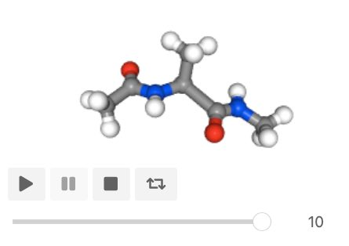
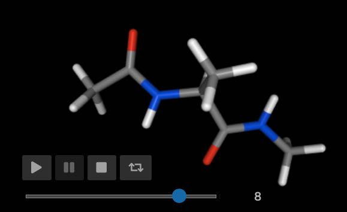
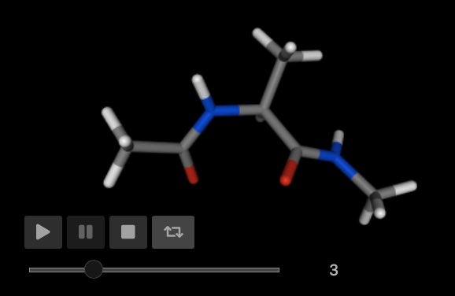
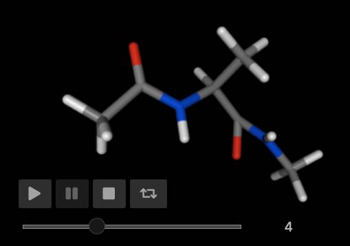

==================================
Moving Bonds, Angles and Dihedrals
==================================

Moving internals (e.g. bonds, angles and dihedrals) within molecules
is also straightforward. You do this via a cursor that edits the internal
(or internals).

Moving Bonds
============

For example, here we will get a cursor that edits all of the
carbon-hydrogen bonds in the first molecule.

>>> mols = sr.load(sr.expand(sr.tutorial_url, ["ala.top", "ala.crd"]))
>>> cursor = mols[0].bonds("element C", "element H").cursor()

Cursors that edit bonds have two additional key functions;

* ``set_length`` / ``set_lengths`` and
* ``change_length`` / ``change_lengths``

These functions either set the bond length to a specified value,
or change the bond length by the specified delta.

For example, we can set the lengths of all of the carbon-hydrogen
bonds to 1 Å using ``set_length``

>>> cursor.set_length(1.0)
>>> print(cursor.lengths())
[1 Å, 1 Å, 1 Å, 1 Å, 1 Å, 1 Å, 1 Å, 1 Å, 1 Å, 1 Å]

.. note::

    Note that you can specify units of length if you want, e.g.
    ``set_length(1 * sr.units.angstrom)``. The default length units
    are used if units aren't specified.

.. note::

    Note also that ``set_length`` sets the length of all bonds edited
    by the cursor to the passed length. Use ``set_lengths`` and pass
    in a list of lengths if you want to set the bonds to
    different lengths.

We can change the length of the third carbon-hydrogen bond by 0.5 Å using
``change_length``, e.g.

>>> cursor[2].change_length(0.5)
>>> print(cursor[2].length())
1.5 Å
>>> print(cursor.lengths())
[1 Å, 1 Å, 1.5 Å, 1 Å, 1 Å, 1 Å, 1 Å, 1 Å, 1 Å, 1 Å]

Tracking movement with trajectories
===================================

You can visualise and analyse the movements you are performing by
saving trajectory frames. For example, lets gradually stretch the
carbon-carbon bond in the first molecule, saving trajectory
frames as we go.

>>> mol = mols[0]
>>> cursor = mol.cursor()
>>> cursor.save_frame()
>>> bond_cursor = cursor.bond("atomname CA", "resname ALA and atomname C")
>>> for i in range(0, 10):
...     bond_cursor.change_length(0.05)
...     bond_cursor.save_frame()
>>> mol = cursor.commit()

You can view a movie of this movement using

>>> mol.view()

You can get the energy for each frame of the trajectory using

>>> mol.trajectory().energy()
    frame  time    1-4_LJ  1-4_coulomb     angle       bond  dihedral  \
0       0   0.0  2.920343    44.880519  6.791894   4.548210  9.532594
1       1   0.0  2.607594    43.652433  6.791894   6.645588  9.532594
2       2   0.0  2.366888    42.448164  6.791894  10.327967  9.532594
3       3   0.0  2.182746    41.267230  6.791894  15.595345  9.532594
4       4   0.0  2.043079    40.109161  6.791894  22.447723  9.532594
5       5   0.0  1.938407    38.973497  6.791894  30.885102  9.532594
6       6   0.0  1.861278    37.859784  6.791894  40.907480  9.532594
7       7   0.0  1.805813    36.767577  6.791894  52.514858  9.532594
8       8   0.0  1.767366    35.696436  6.791894  65.707237  9.532594
9       9   0.0  1.742254    34.645928  6.791894  80.484615  9.532594
10     10   0.0  1.727556    33.615627  6.791894  96.846993  9.532594
    improper  intra_LJ  intra_coulomb       total
0   0.285078 -1.102960     -46.370186   21.485492
1   0.285078 -1.076241     -45.394975   23.043966
2   0.285078 -1.046408     -44.442886   26.263291
3   0.285078 -1.014466     -43.513222   31.127199
4   0.285078 -0.981224     -42.605298   37.623007
5   0.285078 -0.947316     -41.718473   45.740783
6   0.285078 -0.913235     -40.852145   55.472728
7   0.285078 -0.879364     -40.005697   66.812753
8   0.285078 -0.845992     -39.178556   79.756056
9   0.285078 -0.813341     -38.370160   94.298863
10  0.285078 -0.781567     -37.579977  110.438198

Moving Angles
=============

We can move angles in our molecule in a similar way. In this case,
we use the ``set_size`` and ``change_size`` functions of the
:class:`~sire.mol.Cursor`.

>>> mol = mols[0]
>>> cursor = mol.cursor().angles("element C", "element N", "element C")
>>> print(cursor.sizes())
[123.725°, 123.802°]
>>> cursor.set_size(120)
>>> print(cursor.sizes())
[120°, 120°]

.. note ::

    You can specify the angle units, e.g. ``cursor.set_size(125*sr.units.degrees)``.
    If you don't specify the unit, then the default unit (degrees) is used.

The ``set_sizes`` and ``change_sizes`` functions enable you to set the
angles to different sizes in a single function call, e.g.

>>> cursor.set_sizes([115, 125])
>>> print(cursor.sizes())
[115°, 125°]

You could visualise the movement in the same way as you did when moving
bonds.

>>> mol = mols[0]
>>> cursor.set_size(100)
>>> cursor.save_frame()
>>> for i in range(0, 10):
...     cursor.change_size(4)
...     cursor.save_frame()
>>> mol = cursor.commit()
>>> mol.view()

You could get the energy for each frame using

>>> mol.trajectory().energy()
    frame  time     1-4_LJ  1-4_coulomb      angle     bond  dihedral  \
0       0   0.0  30.900211    51.456752  37.326211  4.54821  9.533890
1       1   0.0  18.891062    50.151760  27.403285  4.54821  9.533543
2       2   0.0  11.953834    48.940301  19.412892  4.54821  9.533266
3       3   0.0   7.847938    47.811189  13.358399  4.54821  9.533042
4       4   0.0   5.364667    46.754576   9.242185  4.54821  9.532859
5       5   0.0   3.834074    45.761769   7.065959  4.54821  9.532710
6       6   0.0   2.875548    44.825062   6.830962  4.54821  9.532587
7       7   0.0   2.268087    43.937622   8.538100  4.54821  9.532486
8       8   0.0   1.881119    43.093390  12.188025  4.54821  9.532405
9       9   0.0   1.636824    42.287022  17.781193  4.54821  9.532341
10     10   0.0   1.489374    41.513861  25.317903  4.54821  9.532292
    improper   intra_LJ  intra_coulomb       total
0   0.317684  61.043125     -55.446533  139.679549
1   0.308098  24.833982     -53.481881   82.188059
2   0.300869  10.163214     -51.731143   53.121443
3   0.295320   3.804292     -50.161684   37.036707
4   0.291006   0.901951     -48.747455   27.888000
5   0.287623  -0.470122     -47.467360   23.092862
6   0.284961  -1.130151     -46.304294   21.462885
7   0.282872  -1.446705     -45.244352   22.416321
8   0.281249  -1.594252     -44.276305   25.653841
9   0.280017  -1.658877     -43.391193   31.015537
10  0.279122  -1.684468     -42.582148   38.414145

Moving Dihedrals
================

Dihedrals are moved using a similar syntax as bonds and angles. You use
``set_size`` / ``set_sizes`` to set dihedrals, and
``change_size`` / ``change_sizes`` to change dihedrals. For example;

>>> mol = mols[0]
>>> cursor = mol.cursor().dihedrals("element N", "element C",
                                    "element C", "element N")
>>> print(cursor.sizes())
[163.039°]
>>> cursor.set_size(150)
>>> print(cursor.sizes())
[150°]

You can view a movie of the changes by saving frames to a trajectory, e.g.

>>> mol = mols[0]
>>> cursor = mol.cursor().dihedrals("element N", "element C",
                                    "element C", "element N")
>>> cursor.save_frame()
>>> for i in range(0, 12):
...     cursor.change_size(30)
...     cursor.save_frame()
>>> mol = cursor.commit()
>>> mol.view()

You can get the energies for each frame using;

>>> print(mol.trajectory().energy())
    frame  time    1-4_LJ  1-4_coulomb     angle     bond   dihedral  \
0       0   0.0  2.920343    44.880519  6.791894  4.54821   9.532594
1       1   0.0  2.903734    45.413449  6.791894  4.54821  10.206761
2       2   0.0  2.866713    46.060627  6.791894  4.54821  10.253447
3       3   0.0  2.879910    47.150792  6.791894  4.54821   9.674494
4       4   0.0  3.215898    48.524346  6.791894  4.54821  10.327498
5       5   0.0  3.605072    49.294830  6.791894  4.54821  10.980599
6       6   0.0  3.431110    48.620810  6.791894  4.54821   9.843168
7       7   0.0  3.221010    46.739679  6.791894  4.54821   9.406235
8       8   0.0  3.778984    44.691981  6.791894  4.54821  12.445042
9       9   0.0  4.696463    43.463628  6.791894  4.54821  15.872254
10     10   0.0  4.364056    43.437424  6.791894  4.54821  14.982017
11     11   0.0  3.347161    44.154732  6.791894  4.54821  11.243423
12     12   0.0  2.920343    44.880519  6.791894  4.54821   9.532594
    improper    intra_LJ  intra_coulomb       total
0   0.285078   -1.102960     -46.370186   21.485492
1   0.285078   -1.054636     -46.361446   22.733043
2   0.285078   -1.236196     -46.037819   23.531954
3   0.285078   -1.485350     -45.416578   24.428450
4   0.285078    7.543340     -42.220497   39.015767
5   0.285078  321.043305     -32.911014  363.637974
6   0.285078  246.990282     -31.962216  288.548335
7   0.285078    3.895676     -38.766103   36.121679
8   0.285078    6.624047     -40.837995   38.327241
9   0.285078   19.768052     -41.352134   54.073444
10  0.285078   54.297987     -43.297191   85.409475
11  0.285078   10.276564     -45.440864   35.206198
12  0.285078   -1.102964     -46.370172   21.485502

Moving individual dihedrals
===========================

You may have noticed that all of the atoms around a dihedral were rotated
when you changed an individual dihedral. This is because, by default,
the move rotates the bond that lies at the center of the dihedral.

You can rotate only the specified dihedral by setting the ``move_all``
option to ``False``. For example;

>>> mol = mols[0]
>>> cursor = mol.cursor().dihedrals("element N", "element C",
                                    "element C", "element N")
>>> cursor.save_frame()
>>> for i in range(0, 12):
...     cursor.change_size(30, move_all=False)
...     cursor.save_frame()
>>> mol = cursor.commit()
>>> mol.view()

Notice how this results in a clash between the nitrogen (which is being
rotated) and the oxygen (which is not rotated).

In general, to avoid atom clashes, it is normally better to rotate all
atoms about the central dihedral bond. As such, ``move_all`` defaults
to ``True``.

Aligning, Anchoring and Weighting
=================================

There are a few more options that can be used to give more
fine-grained control over how the molecule is moved.

The first is ``auto_align``. This defaults to ``True``, and switches
on automatic re-alignment of the molecule against itself after the
move. This is a simple alignment that minimises the root mean square
deviation (RMSD) between the molecule before and after the move.

Set ``auto_align`` to ``False`` if you want to switch off this
automatic alignment.

The next option is ``weighting``. The internal moves work by dividing
the molecule into two sets about the bond (or bonds) involved in the move.
For example, to rotate the ``N-C1-C2-N`` dihedral as we did above, the molecule
is split into two sets about the central ``C1-C2`` bond. The "left" set
contains all atoms that are bonded to ``C1``, or which can trace their
connectivity to ``C1`` through other atoms. The "right" set contains
all atoms that are bonded to ``C2``, or which can trace their connectivity
to ``C2`` through other atoms.

The rotation is achieved by rotating the "left" and "right" sets by opposite
amounts around the vector of the ``C1-C2`` bond, depending on the "weight"
of the two sets. For example, if the dihedral was to be rotated by 30°,
and both sets were weighted equally, then one set would be rotated
by +15°, whle the other would be rotated by -15°.

The ``weighting`` option sets the algorithm that is used to weight the
rotation (or translation in the case for bond moves). Valid options are;

* ``relative_mass`` : the change is weighted linearly according to the relative
  mass of the two sets. The lightest set will be moved the most, while the
  heaviest set would move the least.
* ``absolute_mass`` : the change will entirely be weighted towards the set
  with the lightest mass. The lightest set will receive all of the move,
  while the heaviest set will not be moved.
* ``relative_number`` : the change is weighted linearly according to the relative
  number of atoms in both sets. The set with fewest atoms will be moved the most,
  while the set with most atoms will move the least.
* ``absolute_number`` : the change will entirely be weighted towards the set
  with the fewest atoms. The set with the fewest atoms will receive all of the
  move, while the set with the most atoms will not be moved.

Finally, you can specify ``anchor`` atoms using the ``anchor`` option.
This specifies atoms which are anchored, and which should not be moved
at all when you stretch a bond, or change an angle or dihedral. The
``anchor`` option accepts any value that would be supported by
the indexing operator of the view being moved. This will be used to index the
view being moved, to get the set of atoms that must remain immobile.
If one of the sets of atoms to be moved contains an anchor, then
it will not be moved, and the full weight of the move will be applied
to the other set. Note that it is an error to have anchors in both sets,
as this would prevent the move from being made. An exception will be
raised in this case. Note also that setting the ``anchor`` option will
automatically disable automatic alignment.

For example;

>>> cursor.change_size(30, move_all=True,
                       weighting="relative_mass",
                       auto_align=False)

would rotate all of the atoms around a dihedral by 30°, distributing
the move according to the ``relative_mass`` algorithm. The molecule would
not be automatically re-aligned after the move.

or;

>>> cursor.bonds("element C", "element H").set_length(1, anchor="element C")

would set all carbon-hydrogen bonds to a length of 1 Å, while placing
anchors on all the carbon atoms. This ensures that only the hydrogens
will be moved. The use of anchors means that ``auto_align`` is set to
``False``, and so the molecule would not be automatically re-aligned
after the move.
